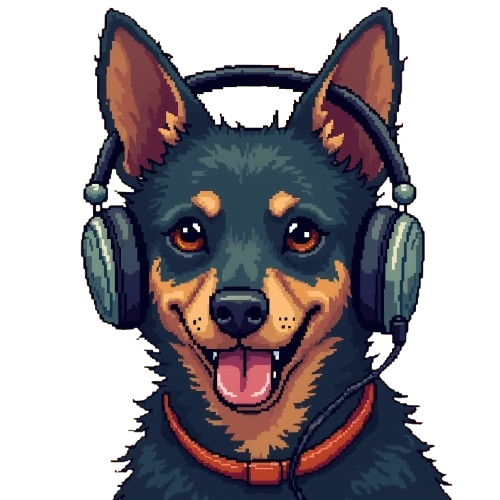

# wisemutts 🐕

Automated Instagram content creation with AI-generated pixel art videos and philosophical narration.

### How It Works

Every day, wisemutts creates and posts beautiful pixel art videos featuring a contemplative dog with whispered wisdom. Each day rotates through five themes:

1. **Presence & Simplicity** - Peace in nature
2. **Alien Scenario** - Wonder and new perspectives
3. **Social Scenario** - Authenticity and individuality
4. **Nighttime Nature** - Serenity under the stars
5. **Lofi Home** - Companionship and quiet moments

This is powered by two custom packages I built:

### [mediaichemy](https://github.com/pedroblayaluz/mediaichemy)

Handles the creative side of wisemutts. It generates the pixel art visuals, creates AI narration, and orchestrates the entire video pipeline. mediaichemy intelligently optimizes costs while maintaining high-quality output, making daily content generation economically viable.

### [instapost](https://github.com/pedroblayaluz/instapost)

Handles posting to Instagram. Once wisemutts has generated the video and captions, instapost takes care of uploading it as a reel to Instagram with the right metadata and captions, keeping everything automated and seamless.

### 🤖 Automation

GitHub Actions CI/CD automatically creates and posts videos daily at 6 PM São Paulo time (9 PM UTC). Every day, the workflow runs, generates fresh content, and posts to Instagram—all without lifting a finger.

**Hosted on AWS:** wisemutts runs as a containerized Lambda function. Docker packages all dependencies (FFmpeg, ONNX runtime, etc.) efficiently, allowing the project to stay within Lambda's size constraints while handling large media processing workloads.

#### Prompt Selection Modes

By default, wisemutts uses **daily rotation** — cycling through prompts based on the day of the year for even distribution. You can configure this behavior:

- **Daily Rotation** (default): `PROMPT_MODE=daily` or unset
- **Random Selection**: `PROMPT_MODE=random` — Randomly select a prompt each run
- **Specific Prompt**: `PROMPT_MODE=0` through `PROMPT_MODE=4` — Choose a specific prompt by index

This is useful for manual runs on GitHub Actions where you want to control which theme to use for content generation.

**Follow [@wisemutts](https://instagram.com/wisemutts) on Instagram for daily wisdom! 📸**

## 🎬 Showcase

Check out some generated videos:

### 0️⃣ 🌿 Presence & Simplicity
https://github.com/user-attachments/assets/4097bf88-76fc-4f21-80ef-fb8fd9f033ad
> *Sometimes the best moments are the quiet ones 🐾✨ Find peace in simply being. Double tap if you needed this reminder 💙
> 
> #peaceful #mindfulness #doglovers #pixelart #calm*

---

### 1️⃣ 👽 Alien Scenario

https://github.com/user-attachments/assets/b04ee83e-d6f6-4290-838b-fff1c87a7347
> *Venture into the unknown and discover your magic ✨🪐 What makes you different makes you beautiful
> 
>  #inspiration #motivation #pixelart #aesthetic #growth*

---

### 2️⃣ 🦋 Authenticity

https://github.com/user-attachments/assets/74e835de-0a49-47c7-9882-6ace671b1013
> *In a world of copies, be an original 🐾✨ Your uniqueness is your superpower. Stay true to you 💙
> 
> #selflove #beyourself #motivation #inspiration #positivevibes*

---

### 3️⃣ 🌙 Nighttime Nature

*Coming soon...*

---

### 4️⃣ 🏠 Lofi Home

*Coming soon...*

